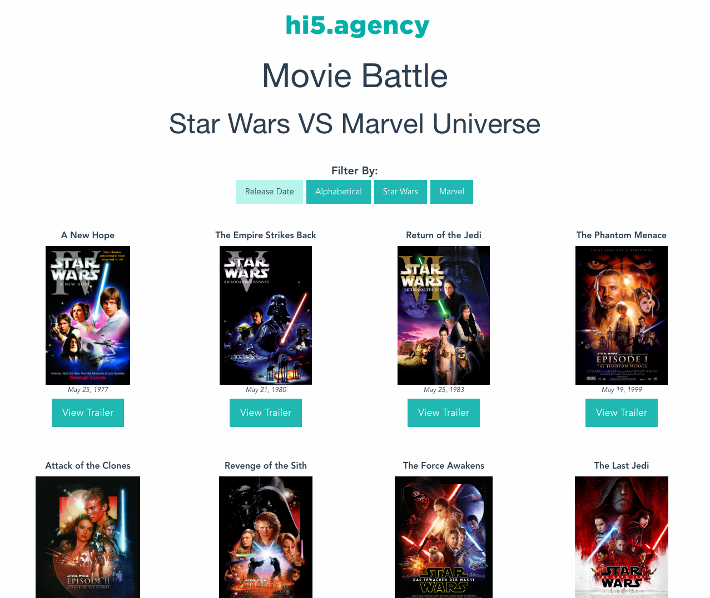

#  hi5.agency Coding Challenge

## Intro

This by no means is a test, there is no right or wrong way of tackling this challenge. The purpose of this challenge is to get a sense of your coding style, and your problem solving technique. The challenge should not set you back more than a couple of hours to get through. Have fun and show us what you got!

### Movie Battle

Build a Movie poster gallery, each poster should link to its trailer.
The Gallery should be responsive going from a single column in mobile to four columns in desktop. You should be able to sort the posters by release day, and alphabetic order, as well as only show posters for either Star Wars or Marvel.

**All copyrights belong to their respective owners.**

### Tasks

- Use the json data inside of `data/` `||` [api.myjson.com/bins/iapkn](https://api.myjson.com/bins/iapkn) to build the gallery. (for the trailers we've provide youtube IDs)
- Use any framework/s you're comfortable to build the gallery app.
- Use the comps provided loosely, mostly there to indicate how it should respond in different view ports. Feel free to add your own style to it.
- If using a build tool please make sure to include your `package.json || yarn.lock` file and any config file `webpack.config.js || gulp.json` ect.
**Bonus Points!**
add some css transitions to and from the gallery page to the trailer page.

### Challenge Complete!
When you're ready to submit either send a link to your repo or zip your project up and send it over to [rquevedo@hi5.agency](mailto:rquevedo@hi5.agency)

### THANKS!
We appreciate you taking your time and taking this challenge.

